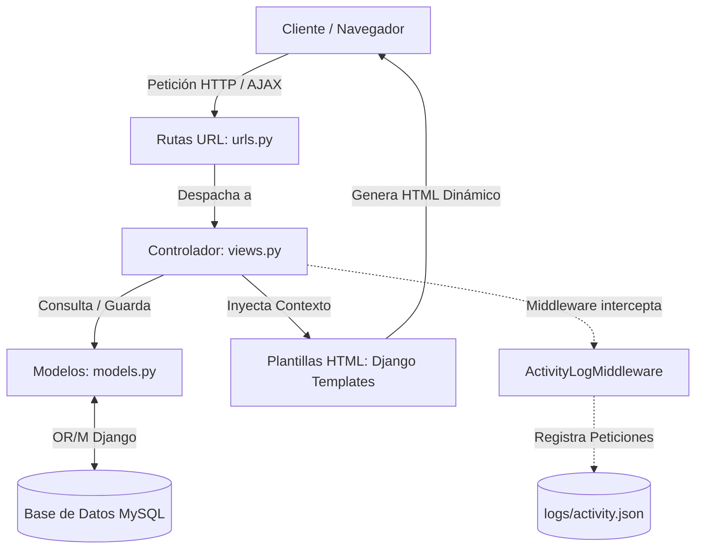
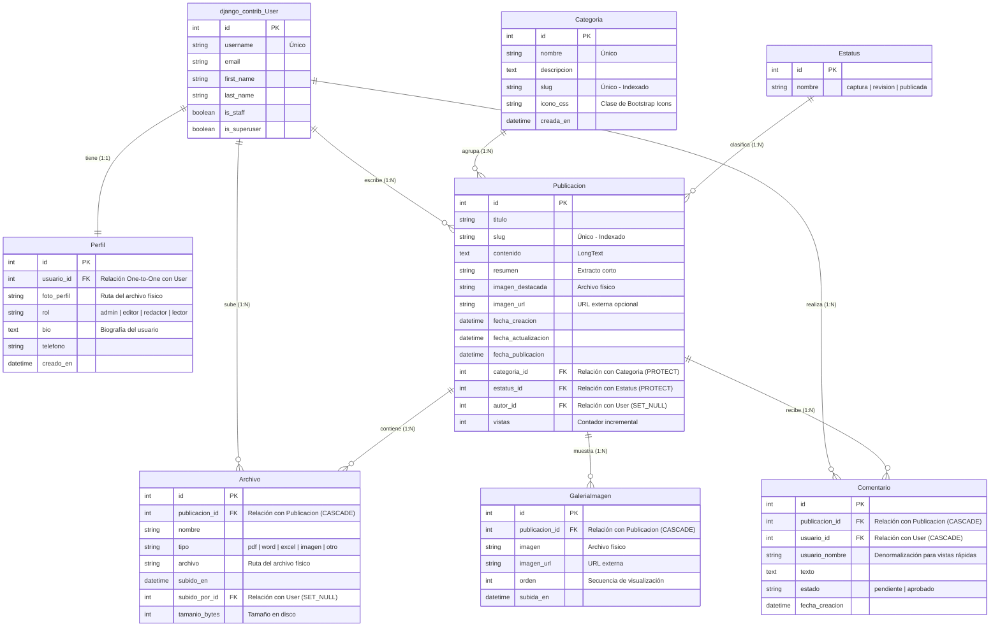

# 🌐 Portal de Noticias CANACINTRA

¡Bienvenido al **Portal de Noticias CANACINTRA**! Esta es una plataforma web desarrollada en Python con el framework **Django 5.x** y base de datos relacional **MySQL**. Está diseñada para la gestión, publicación y visualización interactiva de noticias, artículos de opinión, análisis sectoriales y comunicados oficiales de la Cámara Nacional de la Industria de Transformación (CANACINTRA).

La plataforma incorpora un completo sistema de gestión de contenidos (CMS) con un flujo editorial estructurado por roles de usuario, soporte para archivos adjuntos multi-formato, galerías de imágenes y un panel de control administrativo personalizado que ofrece una experiencia fluida e interactiva de tipo Single Page Application (SPA) mediante peticiones asíncronas (AJAX).

---

## 🚀 Características Principales

El sistema está estructurado bajo el patrón de diseño **MVT (Model-View-Template)** de Django y cuenta con las siguientes funcionalidades clave:

*   **📰 Portada Dinámica:** Sección principal que agrupa las noticias por categorías pre-cargadas e incorpora un carrusel dinámico con las 5 noticias más recientes publicadas en el portal.
*   **🔍 Buscador en Tiempo Real (AJAX):** Barra de búsqueda interactiva en el encabezado con sugerencias autocompletadas al escribir 2 o más caracteres, enlazada a una vista detallada de resultados.
*   **👥 Flujo Editorial Basado en Roles:**
    *   **Administrador:** Acceso total al panel de administración nativo y personalizado, control de usuarios, asignación de roles, gestión de categorías y moderación global.
    *   **Editor:** Creación, edición y publicación de noticias propias o de terceros. Cuenta con la facultad de aprobar o eliminar comentarios de la comunidad.
    *   **Redactor:** Redacción y edición de publicaciones propias. Las noticias quedan en estatus de *Revisión* y no son públicas hasta que un Editor o Administrador las aprueba.
    *   **Lector (Usuario Registrado):** Visualización de noticias públicas, descarga de documentos adjuntos y publicación de comentarios (sujetos a aprobación).
*   **💬 Sistema de Comentarios Moderados:** Los lectores pueden comentar las publicaciones. El sistema mantiene los comentarios en estado *Pendiente* hasta que un moderador los aprueba, previniendo el spam.
*   **📊 Panel de Administración Personalizado (Dashboard):** Interfaz administrativa construida con una arquitectura híbrida basada en peticiones AJAX (`x-requested-with: XMLHttpRequest`). Esto permite navegar, crear, editar y eliminar publicaciones, comentarios, categorías o usuarios sin recargas completas de página.
*   **📁 Gestión de Archivos y Galerías:**
    *   Soporte para múltiples archivos descargables asociados a publicaciones (PDF, Word, Excel, etc.), calculando y mostrando automáticamente el tamaño del archivo en formatos legibles (KB, MB).
    *   Galerías de imágenes secundarias integradas, con opción de carga local o mediante URLs externas.
*   **📝 Registro de Actividad (Logging):** Un middleware personalizado (`ActivityLogMiddleware`) intercepta las peticiones HTTP y escribe un registro estructurado en formato JSON dentro de `logs/activity.json`, ideal para auditorías de seguridad y desempeño.

---

## 🛠️ Tecnologías Utilizadas

La suite tecnológica que da vida al proyecto está integrada por:

| Categoría | Tecnología / Biblioteca | Descripción |
| :--- | :--- | :--- |
| **Núcleo & Backend** | [Python 3.10+](https://www.python.org/) | Lenguaje de programación principal. |
| **Framework Web** | [Django 5.0.x](https://www.djangoproject.com/) | Framework de alto nivel para un desarrollo rápido y limpio. |
| **Base de Datos** | [MySQL 8.0+](https://www.mysql.com/) | Motor de base de datos relacional robusto. |
| **Conector de BD** | `mysqlclient >= 2.2.0` | Driver nativo de MySQL para Python. |
| **Manejo de Imágenes**| `Pillow >= 10.0.0` | Biblioteca para el procesamiento y validación de archivos de imagen. |
| **Frontend UI** | [Bootstrap 5](https://getbootstrap.com/) & [Bootstrap Icons](https://icons.getbootstrap.com/) | Framework CSS y suite de iconos para el diseño responsivo y moderno. |
| **Comunicación** | JavaScript (Fetch API / AJAX) | Permite la carga asíncrona de contenidos en el Dashboard y autocompletado en el buscador. |

---

## 🏗️ Arquitectura del Proyecto

El sistema sigue la clásica arquitectura **MVT** de Django, acoplada con un diseño asíncrono en su panel de administración para mejorar la experiencia de usuario:



1.  **Capa de Presentación (Templates):** Archivos HTML organizados jerárquicamente. Heredan de un `base.html` común e integran Bootstrap 5 para el renderizado responsivo.
2.  **Capa de Negocio (Views):** Controla el flujo de información, la validación de formularios, los permisos de los roles mediante decoradores (`@login_required`) y el formateo de respuestas JSON o HTML parciales para las peticiones AJAX.
3.  **Capa de Datos (Models):** Define el esquema relacional mapeado a la base de datos MySQL por medio del ORM de Django.
4.  **Capa Transversal (Middleware & Context Processors):**
    *   `ActivityLogMiddleware`: Registra datos como método HTTP, ruta, estatus, IP, tiempo de respuesta (en ms) y usuario.
    *   `core_context`: Context processor que expone globalmente las categorías y publicaciones recientes para el pie de página (*footer*), así como alertas de comentarios pendientes para moderadores.

---

## 🗄️ Base de Datos

La persistencia de la aplicación se gestiona sobre un motor **MySQL** bajo un diseño relacional normalizado. 

### Diagrama Entidad-Relación (MER)

A continuación se detalla la estructura lógica de las tablas de la aplicación y sus asociaciones:



### Descripción de Entidades Clave

*   **`django_contrib_User` (django_user):** Tabla nativa de Django para la autenticación básica del sistema.
*   **`Perfil` (`core_perfil`):** Extensión 1:1 de los usuarios para gestionar sus números telefónicos, fotos de avatar, biografías y su nivel de permisos en el flujo de noticias (`rol`).
*   **`Categoria` (`core_categoria`):** Tabla de clasificación para las noticias. Cuenta con slugs autogenerados para optimizar URLs amigables (SEO).
*   **`Estatus` (`core_estatus`):** Define el estado de las noticias en el flujo de publicación (`captura` para borradores, `revision` para moderación por redactores, y `publicada` para público en general).
*   **`Publicacion` (`core_publicacion`):** Contenedor principal de los artículos. Relaciona la noticia con su categoría, su estado actual y su autor original. Registra estadísticas básicas de lectura mediante el campo `vistas`.
*   **`Archivo` (`core_archivo`):** Documentos complementarios enlazados a la noticia. Permite a los usuarios descargar normativas, PDFs informativos o plantillas relacionadas.
*   **`Comentario` (`core_comentario`):** Retroalimentación de los usuarios lectores. Almacena de forma denormalizada el nombre completo del usuario para agilizar consultas directas de base de datos sin necesidad de realizar `JOINs` complejos.

---

## ⚙️ Configuración y Variables de Entorno

Para ejecutar el proyecto en producción o portarlo a otros entornos de bases de datos, es necesario configurar las variables correspondientes. Aunque el archivo `settings.py` cuenta con valores predeterminados para desarrollo local (conector MySQL en XAMPP), puedes crear un archivo `.env` en la raíz del proyecto para desacoplar las credenciales sensibles.

### Ejemplo de Configuración (`.env`):

```bash
# Seguridad
SECRET_KEY=tu_clave_secreta_aqui_para_produccion
DEBUG=False
ALLOWED_HOSTS=localhost,127.0.0.1,canacintra.mx

# Base de Datos (MySQL)
DB_NAME=canancintra
DB_USER=usuario_mysql
DB_PASSWORD=contrasena_segura
DB_HOST=127.0.0.1
DB_PORT=3306

# Configuración de Servidor de Correo (Opcional, para restablecimiento de claves)
EMAIL_HOST=smtp.gmail.com
EMAIL_PORT=587
EMAIL_USE_TLS=True
EMAIL_HOST_USER=soporte@canacintra.mx
EMAIL_HOST_PASSWORD=contrasena_correo
```

> [!NOTE]
> Para la lectura de variables de entorno en Django, se recomienda instalar `django-environ` o `python-dotenv` y modificar la carga de variables al inicio de [settings.py](file:///C:/canacintra/canacintra_project/settings.py).

---

## 🚀 Instalación Paso a Paso

Sigue estas instrucciones detalladas para instalar y ejecutar el proyecto localmente en un entorno Windows:

### 1. Clonar e ingresar al repositorio
Asegúrate de extraer los archivos en un directorio de fácil acceso (ejemplo: `C:\canacintra`).

### 2. Crear y activar el Entorno Virtual (venv)
Abre la terminal (PowerShell o Símbolo del Sistema) en la raíz del proyecto y corre:

*   **En PowerShell:**
    ```powershell
    python -m venv venv
    .\venv\Scripts\Activate.ps1
    ```
*   **En CMD:**
    ```cmd
    python -m venv venv
    .\venv\Scripts\activate.bat
    ```

### 3. Instalar Dependencias
Con el entorno virtual activado, ejecuta la instalación de las librerías necesarias:

```bash
pip install -r requirements.txt
```

> [!TIP]
> Si la instalación del paquete `mysqlclient` falla debido a la falta de herramientas de compilación C++ en Windows, puedes optar por descargar un archivo precompilado `.whl` adecuado para tu versión de Python, o bien instalar e importar `pymysql` usando `install_as_django_database()` en `__init__.py`.

### 4. Inicializar la Base de Datos
1.  Inicia el servidor local de base de datos (por ejemplo, encendiendo el servicio MySQL en **XAMPP Control Panel**).
2.  Abre **phpMyAdmin** en tu navegador (`http://localhost/phpmyadmin/`) o tu gestor de base de datos de preferencia (DBeaver, MySQL Workbench).
3.  Crea un nuevo esquema de base de datos llamado exactamente:
    ```sql
    CREATE DATABASE canancintra CHARACTER SET utf8mb4 COLLATE utf8mb4_spanish_ci;
    ```
4.  Valida que las credenciales de conexión en tu entorno o en el bloque `DATABASES` de [settings.py](file:///C:/canacintra/canacintra_project/settings.py) apunten correctamente a tu servidor local de MySQL (por defecto: usuario `root`, clave `root` y puerto `3306`).

### 5. Correr Migraciones
Crea la estructura de tablas y relaciones en MySQL corriendo el comando de Django:

```bash
python manage.py migrate
```

---

## 🏃 Uso y Carga de Datos de Ejemplo

### Cargar Datos Iniciales (Seeding)
El proyecto cuenta con un script automatizado para inicializar el sistema con los catálogos base (categorías, estatus), publicaciones redactadas de muestra y el usuario Administrador del sistema.

Ejecuta el siguiente comando para poblar la base de datos:

```bash
python seed_data.py
```
*(O de manera alternativa: `python manage.py shell < seed_data.py`)*

### Iniciar el Servidor de Desarrollo
Para poner en marcha la aplicación web localmente, ejecuta:

```bash
python manage.py runserver
```

Una vez iniciado, podrás navegar en los siguientes portales:
*   **Sitio Web Público (Noticias):** [http://127.0.0.1:8000/](http://127.0.0.1:8000/)
*   **Panel Administrativo Personalizado:** [http://127.0.0.1:8000/dashboard/](http://127.0.0.1:8000/dashboard/)
*   **Panel de Administración Nativo de Django:** [http://127.0.0.1:8000/admin/](http://127.0.0.1:8000/admin/)

### 🔑 Credenciales de Acceso por Defecto:
*   **Usuario:** `admin`
*   **Contraseña:** `admin1234`
*   **Correo:** `admin@canacintra.mx`

---

## 🔌 API de Búsqueda (Endpoints)

La plataforma cuenta con un endpoint interno optimizado para consultas dinámicas y autocompletado en el frontend.

### Buscar Noticias (Autocomplete)

*   **Método HTTP:** `GET`
*   **Ruta:** `/api/buscar/`
*   **Descripción:** Consulta las publicaciones que tengan estatus `publicada` y que coincidan con la cadena de búsqueda (`q`) en su título o resumen. Retorna un arreglo con un máximo de 5 sugerencias ordenadas cronológicamente.
*   **Parámetros de URL:**
    *   `q` (string, obligatorio): Término de búsqueda. Requiere un mínimo de 2 caracteres para procesar la solicitud.

#### Ejemplo de Solicitud:
```http
GET /api/buscar/?q=digital HTTP/1.1
Host: 127.0.0.1:8000
Accept: application/json
```

#### Ejemplo de Respuesta (Éxito - 200 OK):
```json
{
  "resultados": [
    {
      "titulo": "CANACINTRA impulsa la transformación digital en el sector manufacturero",
      "url": "/noticia/canacintra-impulsa-la-transformacion-digital-en-el-sector-manufacturero-6b7f3d8a/",
      "categoria": "Tecnología",
      "fecha": "31 May 2026"
    }
  ],
  "query": "digital"
}
```

---

## 📁 Estructura de Carpetas

A continuación se detalla la distribución de archivos y directorios del proyecto:

```
canacintra/
│
├── canacintra_project/             # Configuración del proyecto Django
│   ├── __init__.py
│   ├── asgi.py
│   ├── settings.py                 # Ajustes globales de la app (Base de Datos, logs, etc.)
│   ├── urls.py                     # Configuración principal de enrutamiento web
│   └── wsgi.py
│
├── core/                           # Aplicación principal del negocio
│   ├── migrations/                 # Migraciones de la base de datos
│   ├── __init__.py
│   ├── admin.py                    # Registro de modelos en el panel de Django
│   ├── apps.py
│   ├── context_processors.py       # Inyección de variables globales en HTML
│   ├── middleware.py               # Middleware de logs JSON de peticiones HTTP
│   ├── models.py                   # Modelos relacionales (Tablas)
│   ├── signals.py                  # Eventos y triggers internos
│   ├── tests.py                    # Pruebas unitarias
│   ├── urls.py                     # Enrutamiento local de vistas del core
│   └── views.py                    # Controladores y lógica del Dashboard / Front-end
│
├── logs/                           # Registro estructurado de accesos
│   └── activity.json               # Archivo de logs de peticiones en JSON
│
├── media/                          # Archivos multimedia subidos por usuarios (Git ignored)
│   ├── perfiles/                   # Avatares de perfiles
│   └── publicaciones/              # Archivos informativos e imágenes de noticias
│
├── static/                         # Recursos estáticos de la interfaz
│   └── core/
│       ├── css/
│       │   └── main.css            # Estilos personalizados de la plataforma
│       ├── img/                    # Logotipos e imágenes del portal
│       └── js/                     # AJAX de autocompletado y navegación SPA
│
├── templates/                      # Vistas (Plantillas HTML)
│   ├── base.html                   # Plantilla base del frontend general
│   └── core/
│       ├── partials/               # Fragmentos HTML para respuestas AJAX asíncronas
│       ├── admin_perfil.html       # Edición de perfil de usuario en Dashboard
│       ├── admin_noticias.html     # Listado y control de publicaciones del redactor
│       ├── admin_noticias_form.html # Formulario unificado de creación y edición
│       ├── admin_comentarios.html  # Interfaz de moderación y aprobación
│       ├── admin_categorias.html   # Administración de temas
│       ├── admin_usuarios.html     # ABM de usuarios y asignación de roles
│       ├── index.html              # Portada del sitio de noticias
│       └── publicacion_detalle.html # Página de lectura y envío de comentarios
│
├── manage.py                       # Utilidad CLI principal de Django
├── requirements.txt                # Dependencias de paquetes Python
├── seed_data.py                    # Script de poblamiento de base de datos
└── test_fetch.py                   # Script de pruebas internas para controladores
```
