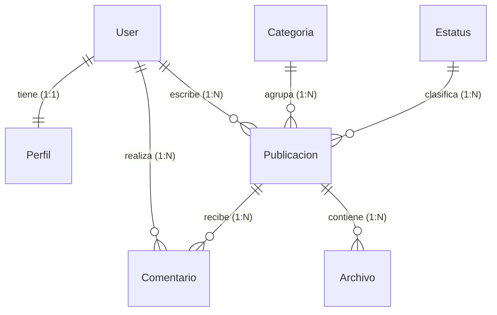

# Portal de Noticias CANACINTRA

Plataforma web para la gestión, publicación y visualización interactiva de noticias, artículos de opinión, análisis sectoriales y comunicados oficiales de la Cámara Nacional de la Industria de Transformación (CANACINTRA).

El sistema cuenta con un flujo editorial estructurado por roles de usuario, un panel de administración interactivo (AJAX) con comportamiento similar a una Single Page Application (SPA), y registro de actividad detallado para auditoría interna.

# Características

* **Flujo Editorial por Roles:** Niveles de acceso diferenciados para Administrador, Editor, Redactor y Lector (Usuario Registrado).
* **Panel de Administración AJAX:** Interfaz interactiva de control para realizar operaciones CRUD sobre publicaciones, comentarios, categorías y usuarios sin recargas de página.
* **Buscador en Tiempo Real:** Barra de búsqueda predictiva que muestra sugerencias dinámicas mediante Fetch API al ingresar 2 o más caracteres.
* **Moderación de Comentarios:** Cola de aprobación intermedia para comentarios de los lectores, previniendo el spam.
* **Gestión de Archivos Adjuntos:** Soporte para asociar documentos descargables (PDF, Word, Excel) a noticias con cálculo automático de su tamaño.
* **Auditoría de Actividad:** Middleware personalizado para registrar las peticiones HTTP y sus tiempos de respuesta en logs formateados en JSON.

# Tecnologías Utilizadas

| Categoría | Tecnología / Biblioteca | Descripción |
| :--- | :--- | :--- |
| **Lenguaje** | Python 3.10+ | Lenguaje base del backend. |
| **Framework** | Django 5.0.x | Framework de desarrollo ágil bajo el patrón MVT. |
| **Base de Datos** | MySQL 8.0+ | Motor relacional de almacenamiento. |
| **Frontend** | Bootstrap 5 & Vanilla JS | Diseño responsivo e interacciones asíncronas (AJAX/Fetch). |

# Instalación

1. **Clonar el proyecto** e ingresar a la carpeta del repositorio:
   ```bash
   git clone <url-del-repositorio>
   cd canacintra
   ```

2. **Crear y activar un entorno virtual (venv)**:
   * **En PowerShell:**
     ```powershell
     python -m venv venv
     .\venv\Scripts\Activate.ps1
     ```
   * **En CMD:**
     ```cmd
     python -m venv venv
     .\venv\Scripts\activate.bat
     ```

3. **Instalar dependencias**:
   ```bash
   pip install -r requirements.txt
   ```

4. **Crear la base de datos** en su gestor MySQL local:
   ```sql
   CREATE DATABASE canancintra CHARACTER SET utf8mb4 COLLATE utf8mb4_spanish_ci;
   ```

5. **Aplicar las migraciones de Django**:
   ```bash
   python manage.py migrate
   ```

# Configuración

Cree un archivo `.env` en la raíz del proyecto para configurar las credenciales del entorno local o de producción:

```env
# Seguridad
SECRET_KEY=tu_clave_secreta_aqui
DEBUG=True
ALLOWED_HOSTS=localhost,127.0.0.1

# Base de Datos (MySQL)
DB_NAME=canancintra
DB_USER=root
DB_PASSWORD=contrasena_mysql
DB_HOST=127.0.0.1
DB_PORT=3306
```

# Uso

1. **Poblar base de datos** con catálogos base, contenido inicial y el usuario administrador por defecto:
   ```bash
   python seed_data.py
   ```

2. **Iniciar el servidor de desarrollo**:
   ```bash
   python manage.py runserver
   ```

3. **Acceder a la aplicación**:
   * **Sitio Web Público (Noticias):** [http://127.0.0.1:8000/](http://127.0.0.1:8000/)
   * **Dashboard Administrativo:** [http://127.0.0.1:8000/dashboard/](http://127.0.0.1:8000/dashboard/)
   * **Admin Nativo de Django:** [http://127.0.0.1:8000/admin/](http://127.0.0.1:8000/admin/) (Usuario: `admin` / Contraseña: `admin1234`)

# Base de Datos

El sistema emplea una base de datos relacional **MySQL** que gestiona la estructura de usuarios, sus roles editoriales y la moderación del contenido.

* **User & Perfil:** Gestión de cuentas y su extensión One-to-One para definir biografías, avatares y el rol del flujo editorial (admin, editor, redactor, lector).
* **Categoria & Estatus:** Clasificaciones de noticias y definición del estado actual de publicación (captura, revisión, publicada).
* **Publicacion:** Entidad principal que almacena noticias, relacionando el autor original, la categoría, el estatus y el número de visualizaciones.
* **Comentario & Archivo:** Aportaciones moderadas de los lectores e información complementaria descargable adjunta a cada artículo.



# API

El proyecto expone un endpoint interno destinado al buscador dinámico de la interfaz:

| Endpoint | Método | Parámetros | Descripción |
| :--- | :--- | :--- | :--- |
| `/api/buscar/` | `GET` | `q` (mínimo 2 caracteres) | Devuelve hasta 5 sugerencias en formato JSON de noticias que coincidan con la consulta en título o resumen. |

# Estructura del Proyecto

A continuación se listan los directorios y archivos principales de la plataforma:

```
canacintra/
├── canacintra_project/     # Archivos de configuración del proyecto Django (settings, urls)
├── core/                   # Aplicación principal del negocio
│   ├── middleware.py       # Registro de accesos (logs) en formato JSON
│   ├── models.py           # Definición de tablas y relaciones de base de datos
│   └── views.py            # Lógica y procesamiento de vistas públicas y dashboard
├── static/                 # Recursos de frontend (CSS, JS, imágenes estáticas)
├── templates/              # Plantillas HTML organizadas por plantillas públicas y parciales AJAX
├── manage.py               # Herramienta de interfaz de comandos de Django
└── seed_data.py            # Script inicial de poblamiento (seeding) de datos
```
